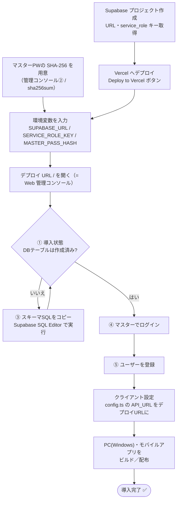
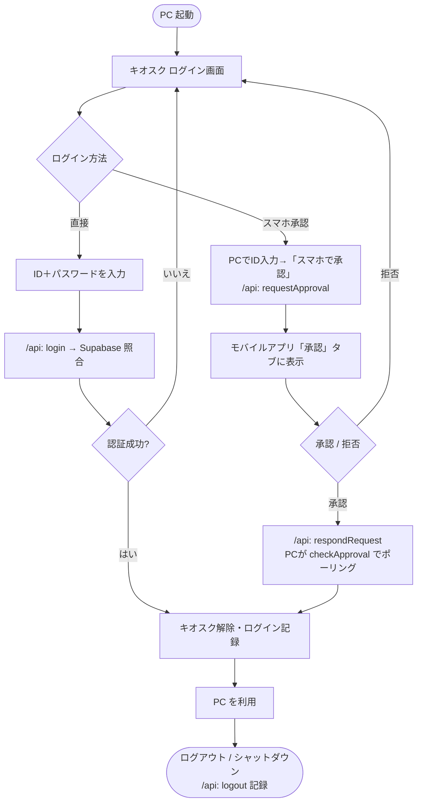
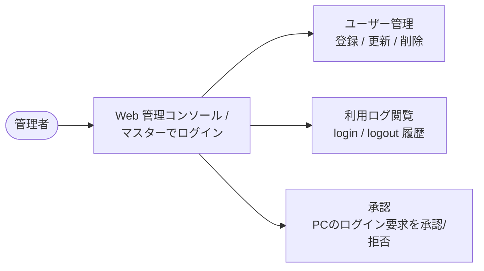

# PC Login Control System — セットアップ手順

> **React Native + Supabase/Vercel 構成に再構築しました。**
> クライアントは React Native for Windows（PC キオスク）とモバイル承認アプリ、
> バックエンドは **Supabase（PostgreSQL）+ Vercel（サーバーレスAPI）** です。
> - クライアント: [`react-native/README.md`](react-native/README.md)
> - バックエンド: [`server/README.md`](server/README.md) / [`supabase/README.md`](supabase/README.md)
> - 旧 Electron 版は [`electron/`](electron/)、旧 GAS 版は [`gas/`](gas/) に参照用として残しています。

## 🚀 かんたん導入（GUI・コード編集不要）

1. **Vercel にワンクリックデプロイ**（環境変数は画面で入力）

   [](https://vercel.com/new/clone?repository-url=https%3A%2F%2Fgithub.com%2FC0uki%2Fpc-login-control&root-directory=server&env=SUPABASE_URL,SUPABASE_SERVICE_ROLE_KEY,MASTER_PASS_HASH&project-name=pc-login-control&repository-name=pc-login-control)

2. デプロイURL（`https://<app>.vercel.app/`）を開くと **Web 管理コンソール** が表示されます。
   マスターPWハッシュ生成 → DB初期化SQLのコピー → 導入状態チェック → ユーザー登録/ログ/承認まで、
   すべて**ブラウザだけ**で完結します（ビルド不要・どの環境でも動作）。

詳細は [`server/README.md`](server/README.md#-かんたん導入gui-中心) を参照してください。
以下は各コンポーネントの個別セットアップ手順です。

## 構成概要

```
┌──────────────────────────┐   requestApproval /      ┌──────────────────────┐
│  pc-windows (Windows PC) │   checkApproval / login   │  Vercel              │
│  React Native for Windows│ ────────POST /api───────▶ │  サーバーレスAPI     │
│  ・キオスクログイン      │ ◀── JSON { success,... } ─│  (TypeScript)        │
│  ・ショートカット遮断    │                           └──────────┬───────────┘
└──────────────────────────┘                                      │ service_role
                                                       ┌──────────▼───────────┐
┌──────────────────────────┐   listRequests /          │  Supabase (Postgres) │
│  mobile (iOS / Android)  │   respondRequest / getLogs │  ・users             │
│  React Native            │ ────────POST /api───────▶ │  ・logs              │
│  ・PCログインを承認      │ ◀───────────────────────  │  ・approval_requests │
│  ・利用ログ閲覧          │                           └──────────────────────┘
└──────────────────────────┘
```

---

## 導入・運用フロー

導入（セットアップ）と、日々の運用（利用者ログイン・管理者）の流れです。

### 1. 導入（セットアップ）

コード編集なし・ブラウザ中心。①〜⑤は Web 管理コンソールの手順に対応します。



### 2. 運用 — 利用者のログイン

「直接ログイン」と「スマホ承認」の 2 経路。どちらも Vercel API 経由で Supabase に記録されます。



### 3. 運用 — 管理者

デプロイ URL の `/`（Web 管理コンソール）から、随時ブラウザだけで運用できます。



---

## STEP 1: Supabase（データベース）

1. [Supabase](https://supabase.com/) で新規プロジェクトを作成
2. 「SQL Editor」で [`supabase/schema.sql`](supabase/schema.sql) を実行
   （`users` / `logs` / `approval_requests` を作成）
3. 「Project Settings → API」から **Project URL** と **service_role キー** を控える

詳細: [`supabase/README.md`](supabase/README.md)

---

## STEP 2: Vercel（サーバーレスAPI）

```bash
cd server
npm install
npx vercel                       # プロジェクトをリンク
npx vercel env add SUPABASE_URL
npx vercel env add SUPABASE_SERVICE_ROLE_KEY
npx vercel env add MASTER_PASS_HASH   # マスターPWの SHA-256
npx vercel deploy --prod
```

デプロイ後の `https://<app>.vercel.app/api` が API エンドポイントです。
マスターPWのハッシュは `printf '%s' 'あなたのPW' | sha256sum` で取得できます。

詳細: [`server/README.md`](server/README.md)

---

## STEP 3: ユーザー登録

GAS 版の Google フォームは廃止し、**マスター権限の `register` API** に置き換えました。
API 経由（`@pclc/core` の `register()` / curl）か、Supabase の Table Editor で
`users` に追加します（`hashed_password` は平文PWの SHA-256）。手順は
[`server/README.md`](server/README.md#ユーザー登録google-フォームの置き換え) を参照。

既存スプレッドシートからの移行手順も同 README に記載しています
（ハッシュ方式は同一のため既存パスワードはそのまま利用可能）。

---

## STEP 4: React Native アプリの設定

PC クライアント（Windows）とモバイルアプリ（iOS / Android）のセットアップ手順は
[`react-native/README.md`](react-native/README.md) にまとめています。要点のみ:

1. 依存インストール

   ```bash
   cd react-native
   npm install
   ```

2. `react-native/packages/core/src/config.ts` の `API_URL` に STEP 2 の URL を貼り付け

   ```ts
   export const API_URL = 'https://your-app.vercel.app/api';
   ```

3. PC（Windows）クライアント

   ```bash
   cd pc-windows
   npx react-native-windows-init --overwrite --language cs   # 初回のみ
   npm run windows
   ```

4. モバイルアプリ

   ```bash
   cd mobile
   npm run android   # または npm run ios（macOS）
   ```

---

## STEP 5: 運用フロー

- **直接ログイン**: PC で ID + パスワードを入力してログイン（従来どおり）
- **スマホ承認**: PC で ID を入力 →「スマホで承認する」→ モバイルアプリで承認 → PC ログイン
- ログイン / ログアウトは「利用ログ」に記録され、モバイルアプリで閲覧可能

> PC の全画面キオスク化・スタートアップ登録・タスクマネージャー無効化は
> ネイティブモジュール（`react-native/pc-windows/windows-native/KioskModule.cs`）が担当します。
> 詳細と制限事項は同フォルダの README を参照してください。

---

## 注意事項

| 項目 | 内容 |
|------|------|
| 管理者権限 | タスクマネージャー無効化にはアプリの管理者実行が必要 |
| Ctrl+Alt+Del | OS レベルのため完全なブロックは不可（仕様上の限界） |
| ログ漏れ | 強制終了・電源断時のログアウト記録は保証されません |
| オフライン | インターネット未接続時はマスターパスワードのみ使用可能 |

---

## ファイル構成

```
pc-login-control/
├── README.md
├── supabase/                 ← ★ データベース（PostgreSQL）
│   ├── schema.sql            ← テーブル / RLS 定義
│   └── README.md
├── server/                   ← ★ Vercel サーバーレスAPI + 管理コンソール
│   ├── api/index.ts          ← エンドポイント（POST /api）
│   ├── lib/{handlers,auth,supabase,types}.ts
│   ├── index.html            ← Web 管理コンソール（GUI・/ で配信）
│   ├── app.js / styles.css / sha256.js
│   └── README.md             ← Supabase + Vercel セットアップ
├── react-native/             ← ★ React Native 版（クライアント）
│   ├── README.md
│   ├── packages/core/        ← 共通TS（API / crypto / types）
│   ├── pc-windows/           ← RN for Windows（キオスクログイン）
│   │   └── windows-native/   ← C# ネイティブモジュール（キオスク制御）
│   └── mobile/               ← RN モバイル（承認 / ログ閲覧）
├── gas/                      ← 旧 Google Apps Script 版（参照用）
│   └── Code.gs
└── electron/                 ← 旧 Electron 版（参照用）
    ├── main.js
    ├── preload.js
    └── renderer/{index.html,login.js}
```
