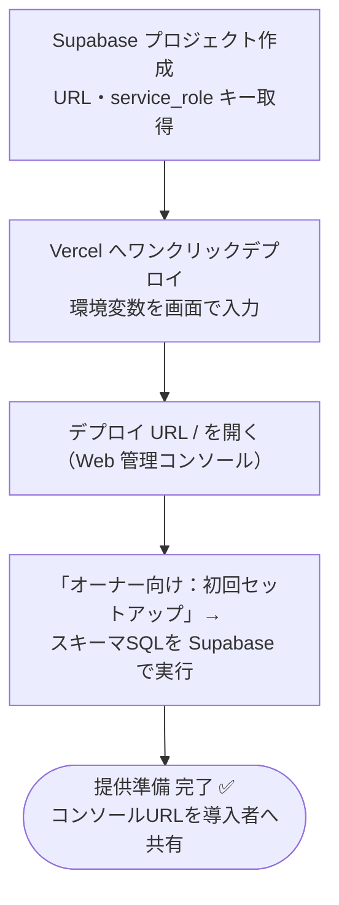
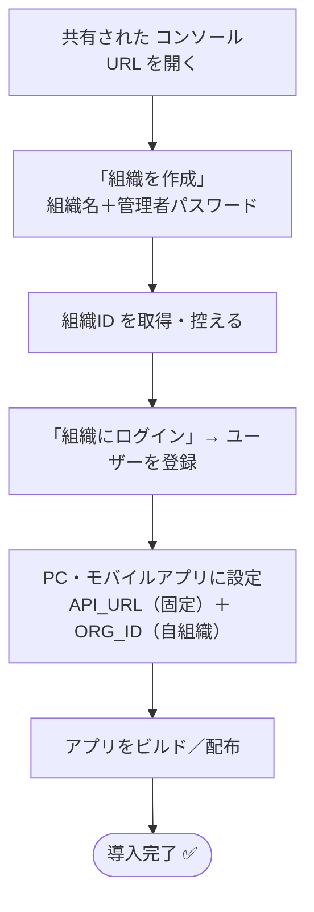

# PC Login Control System — セットアップ手順

> **React Native + Supabase/Vercel 構成に再構築しました。**
> クライアントは React Native for Windows（PC キオスク）とモバイル承認アプリ、
> バックエンドは **Supabase（PostgreSQL）+ Vercel（サーバーレスAPI）** です。
> - クライアント: [`react-native/README.md`](react-native/README.md)
> - バックエンド: [`server/README.md`](server/README.md) / [`supabase/README.md`](supabase/README.md)
> - 旧 Electron 版は [`electron/`](electron/)、旧 GAS 版は [`gas/`](gas/) に参照用として残しています。

## 🚀 かんたん導入（マルチテナント SaaS）

**オーナーが1つのバックエンド（Supabase + Vercel）を運用**し、**導入者は「組織」を作るだけ**で使えます。
役割は2つに分かれます。

### 導入者（各組織の管理者）— クラウド操作は不要

1. オーナーから共有された **コンソールURL** をブラウザで開く
2. 「**組織を作成**」に組織名と管理者パスワードを入力 → 表示された **組織ID** を控える
3. 「組織にログイン」→ ユーザー登録・利用ログ・承認を**ブラウザだけ**で管理
4. PC・モバイルアプリに、固定の **API_URL** と自分の **組織ID (`ORG_ID`)** を設定して配布

> Supabase や Vercel のアカウント作成・操作は一切不要です。

### オーナー（システム提供者）— 初回のみ

1. **Vercel にワンクリックデプロイ**（環境変数 `SUPABASE_URL` / `SUPABASE_SERVICE_ROLE_KEY` を画面入力。組織作成を制限するなら任意で `SIGNUP_CODE`）

   [](https://vercel.com/new/clone?repository-url=https%3A%2F%2Fgithub.com%2FC0uki%2Fpc-login-control&root-directory=server&env=SUPABASE_URL,SUPABASE_SERVICE_ROLE_KEY&project-name=pc-login-control&repository-name=pc-login-control)

2. デプロイURL の `/` を開き、「**オーナー向け：初回セットアップ**」から **スキーマSQL** を Supabase で実行
3. あとは導入者にコンソールURLを共有するだけ

詳細は [`server/README.md`](server/README.md) を参照してください。

## 構成概要

```
┌──────────────────────────┐   requestApproval /      ┌──────────────────────┐
│  pc-windows (Windows PC) │   checkApproval / login   │  Vercel              │
│  React Native for Windows│ ────────POST /api───────▶ │  サーバーレスAPI     │
│  ・キオスクログイン      │ ◀── JSON { success,... } ─│  (TypeScript)        │
│  ・ショートカット遮断    │                           └──────────┬───────────┘
└──────────────────────────┘                                      │ service_role
                                                       ┌──────────▼───────────┐
┌──────────────────────────┐   listRequests /          │  Supabase (Postgres) │
│  mobile (iOS / Android)  │   respondRequest / getLogs │  ・organizations     │
│  React Native            │ ────────POST /api───────▶ │  ・users / logs      │
│  ・PCログインを承認      │ ◀───────────────────────  │  ・approval_requests │
│  ・利用ログ閲覧          │                           └──────────────────────┘
└──────────────────────────┘
```

> オーナーが1つのバックエンド（Supabase + Vercel）を運用し、各組織（`org_id`）で
> データを分離するマルチテナント構成です。導入者は「組織」を作るだけで利用できます。

---

## 導入・運用フロー

導入（セットアップ）と、日々の運用（利用者ログイン・管理者）の流れです。

### 1a. 導入 — オーナー（初回のみ）

Supabase / Vercel を用意するのはこの一度だけ。以後の導入者は触りません。



### 1b. 導入 — 導入者（各組織・クラウド操作なし）



### 2. 運用 — 利用者のログイン

「直接ログイン」と「スマホ承認」の 2 経路。どちらも Vercel API 経由で Supabase に記録されます。


### 3. 運用 — 管理者

デプロイ URL の `/`（Web 管理コンソール）から、随時ブラウザだけで運用できます。


---

> **以下はオーナー向けの詳細手順です。** 導入者はここから先を実施する必要はありません
> （オーナーから共有された **コンソールURL** を開いて「組織を作成」するだけ）。

## STEP 1: Supabase（データベース）※オーナーのみ

1. [Supabase](https://supabase.com/) で新規プロジェクトを作成
2. 「SQL Editor」で [`supabase/schema.sql`](supabase/schema.sql) を実行
   （`organizations` / `users` / `logs` / `approval_requests` を作成）
3. 「Project Settings → API」から **Project URL** と **service_role キー** を控える

詳細: [`supabase/README.md`](supabase/README.md)

---

## STEP 2: Vercel（サーバーレスAPI）※オーナーのみ

```bash
cd server
npm install
npx vercel                       # プロジェクトをリンク
npx vercel env add SUPABASE_URL
npx vercel env add SUPABASE_SERVICE_ROLE_KEY
# 任意: 組織作成を制限する場合のみ  npx vercel env add SIGNUP_CODE
npx vercel deploy --prod
```

デプロイ後、`https://<app>.vercel.app/` が **管理コンソール**、`…/api` が API エンドポイントです。
マスターパスワードは組織ごとにコンソールで設定するため、環境変数での設定は不要になりました。

詳細: [`server/README.md`](server/README.md)

---

## STEP 3: 組織とユーザー（導入者）

各導入者は、コンソールURL の「**組織を作成**」で組織を作り、表示される **組織ID** を控えます。
その後「組織にログイン」→「ユーザー」タブで、ID・名前・初期パスワードを入力して登録します
（すべてブラウザ操作。内部的には `register` API）。**Supabase / Vercel を直接触る必要はありません。**

---

## STEP 4: React Native アプリの設定

PC クライアント（Windows）とモバイルアプリ（iOS / Android）のセットアップ手順は
[`react-native/README.md`](react-native/README.md) にまとめています。要点のみ:

1. 依存インストール

   ```bash
   cd react-native
   npm install
   ```

2. `react-native/packages/core/src/config.ts` を設定
   - `API_URL`: オーナーの固定 API URL（全組織共通）
   - `ORG_ID`: 導入者が取得した組織ID（`setOrgId()` で実行時に上書きも可能）

   ```ts
   export const API_URL = 'https://<owner-app>.vercel.app/api';
   export const ORG_ID  = 'あなたの組織ID';
   ```

3. PC（Windows）クライアント

   ```bash
   cd pc-windows
   npx react-native-windows-init --overwrite --language cs   # 初回のみ
   npm run windows
   ```

4. モバイルアプリ

   ```bash
   cd mobile
   npm run android   # または npm run ios（macOS）
   ```

---

## STEP 5: 運用フロー

- **直接ログイン**: PC で ID + パスワードを入力してログイン（従来どおり）
- **スマホ承認**: PC で ID を入力 →「スマホで承認する」→ モバイルアプリで承認 → PC ログイン
- ログイン / ログアウトは「利用ログ」に記録され、モバイルアプリで閲覧可能

> PC の全画面キオスク化・スタートアップ登録・タスクマネージャー無効化は
> ネイティブモジュール（`react-native/pc-windows/windows-native/KioskModule.cs`）が担当します。
> 詳細と制限事項は同フォルダの README を参照してください。

---

## 注意事項

| 項目 | 内容 |
|------|------|
| 管理者権限 | タスクマネージャー無効化にはアプリの管理者実行が必要 |
| Ctrl+Alt+Del | OS レベルのため完全なブロックは不可（仕様上の限界） |
| ログ漏れ | 強制終了・電源断時のログアウト記録は保証されません |
| オフライン | インターネット未接続時はマスターパスワードのみ使用可能 |

---

## ファイル構成

```
pc-login-control/
├── README.md
├── supabase/                 ← ★ データベース（PostgreSQL）
│   ├── schema.sql            ← テーブル / RLS 定義
│   └── README.md
├── server/                   ← ★ Vercel サーバーレスAPI + 管理コンソール
│   ├── api/index.ts          ← エンドポイント（POST /api）
│   ├── lib/{handlers,auth,supabase,types}.ts
│   ├── index.html / styles.css  ← Web 管理コンソール（GUI・/ で配信）
│   ├── console/{app,sha256}.ts  ← コンソール(TypeScript)。tsc で console/*.js を生成
│   └── README.md             ← Supabase + Vercel セットアップ
├── react-native/             ← ★ React Native 版（クライアント）
│   ├── README.md
│   ├── packages/core/        ← 共通TS（API / crypto / types）
│   ├── pc-windows/           ← RN for Windows（キオスクログイン）
│   │   └── windows-native/   ← C# ネイティブモジュール（キオスク制御）
│   └── mobile/               ← RN モバイル（承認 / ログ閲覧）
├── gas/                      ← 旧 Google Apps Script 版（参照用）
│   └── Code.gs
└── electron/                 ← 旧 Electron 版（参照用）
    ├── main.js
    ├── preload.js
    └── renderer/{index.html,login.js}
```
